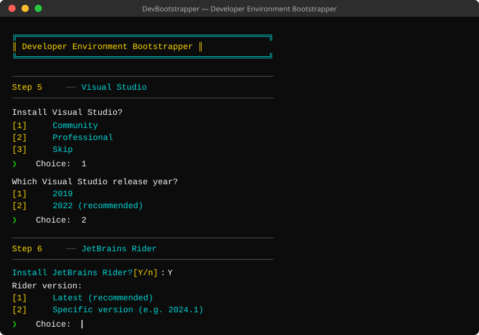
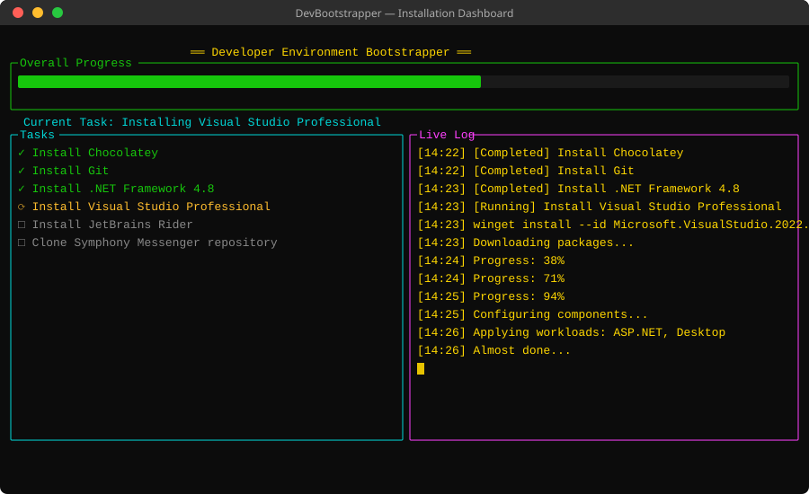
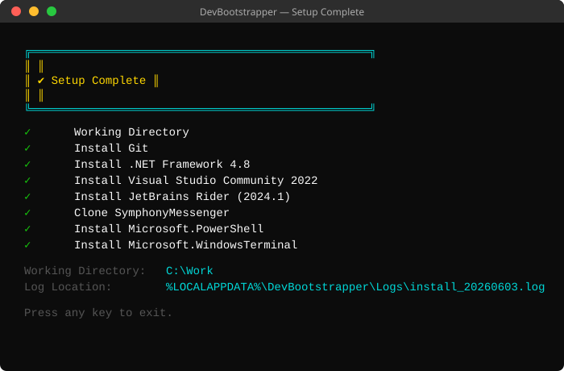

# DevBootstrapper

A **.NET 10** interactive console wizard that automates installation of a complete developer environment (Visual Studio, JetBrains Rider, .NET Framework 4.8, Git) using **winget** or **Chocolatey**, with optional Symphony Messenger repository cloning.

---

## Screenshots

### Wizard – Step-by-step setup prompts



### Installation Dashboard – Live progress with Terminal.Gui



### Completion Screen – Summary of installed tools



---

## Features

- **9-step interactive wizard** – guided prompts from environment selection through to installation review; followed by a live installation phase and a completion summary
- **Vivid Terminal.Gui dashboard** – full-screen TUI with bright 16-colour schemes, a live progress bar, task list and scrolling log panel
- **Dual package providers** – winget (preferred) or Chocolatey with optional auto-install; auto-detect mode picks the best available provider
- **Secure product key input** – VS Professional key is read char-by-char, masked (`*`), and cleared from memory immediately; never reaches any log file
- **.NET Framework 4.8 detection** – checks `HKLM\SOFTWARE\Microsoft\NET Framework Setup\NDP\v4\Full` (release value ≥ 528040) before offering installation
- **Skip already-installed tools** – each task is checked before running, avoiding duplicate installs
- **Persistent log** – `%LOCALAPPDATA%\DevBootstrapper\Logs\install_<timestamp>.log`

---

## Prerequisites

| Requirement | Notes |
|---|---|
| Windows 10 / 11 | Registry-based checks require Windows |
| .NET 10 SDK | [Download](https://dotnet.microsoft.com/download/dotnet/10.0) |
| winget **or** Chocolatey | At least one must be present, or choose auto-install Chocolatey |

---

## Getting Started

```bash
# Clone the repository
git clone https://github.com/dotnetappdev/symp-check.git
cd symp-check

# Build
dotnet build src/DevBootstrapper/DevBootstrapper.csproj

# Run (requires Windows – uses winget / Chocolatey / registry APIs)
dotnet run --project src/DevBootstrapper/DevBootstrapper.csproj
```

> **Note:** The installer calls `winget` / `choco` and writes to the Windows registry. Run in an elevated terminal when installing software.

---

## Wizard Steps

The program runs **9 interactive configuration steps** followed by an installation phase and completion summary.

| Step | Description |
|---|---|
| 1 | Select environment (Symphony Messenger or Custom) |
| 2 | Choose working directory (default `C:\Work`) |
| 3 | Repository setup – clone Symphony Messenger and/or additional repos |
| 4 | Select package provider (Auto / winget / Chocolatey) |
| 5 | Visual Studio edition (Community / Professional / Skip) |
| 6 | JetBrains Rider (Yes / No) |
| 7 | .NET Framework 4.8 (auto-detected, skip if already installed) |
| 8 | Git (auto-detected, skip if already installed) |
| 9 | Review configuration and confirm |
| — | **Installation** – Terminal.Gui live dashboard (progress bar, task list, log) |
| — | **Completion** – console summary of installed tools and log path |

---

## Project Structure

```
src/DevBootstrapper/
├── Models/
│   ├── InstallTask.cs          – task + InstallStatus enum
│   └── SetupConfiguration.cs   – all wizard state
├── Wizard/
│   ├── SetupWizard.cs          – 11-step interactive prompts
│   └── TaskListBuilder.cs      – builds task list from config
├── Services/
│   ├── PackageProviderService.cs – winget / choco detection & invocation
│   ├── GitService.cs             – git detection & clone
│   ├── SystemCheckService.cs     – registry-based .NET Framework 4.8 detection
│   └── LogService.cs             – timestamped log file writer
├── Installers/
│   └── InstallOrchestrator.cs  – async orchestration, skips installed tools
├── UI/
│   ├── ProgressDashboard.cs    – Terminal.Gui TUI (progress bar, task list, log)
│   └── CompletionScreen.cs     – console completion summary
└── Program.cs                  – entry point
```

---

## Dependencies

| Package | Version | Purpose |
|---|---|---|
| `Terminal.Gui` | 2.0.0 | Full-screen TUI progress dashboard |

---

## Colour Scheme

The Terminal.Gui dashboard uses a vivid 16-colour palette (matching the style of Terminal.Gui's own demo applications):

| Panel | Colour |
|---|---|
| Title banner | Bright Yellow on Black |
| Overall Progress frame | Bright Green on Black |
| Progress bar | Bright Green fill |
| Current task label | Bright Cyan on Black |
| Tasks panel | Bright Cyan borders, White text |
| Live Log panel | Bright Magenta borders, Bright Yellow text |

The console wizard steps and completion screen use matching bright `ConsoleColor` values (Cyan for step headers, Yellow for choices and warnings, Green for checkmarks).

---

## Security Notes

- Product keys entered in Step 5 are **never logged** – the value is held in a `StringBuilder` that is explicitly cleared (`.Clear()`) immediately after use and the result is not stored in any field or passed to any log method.
- No credentials or keys are written to disk at any point.

---

## License

This project is part of the [symp-check](https://github.com/dotnetappdev/symp-check) repository.
